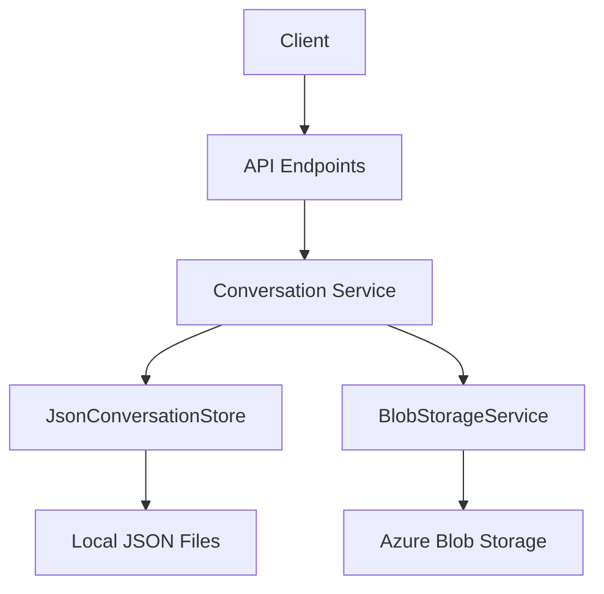

# Trapper Keeper API 🗂️

[](https://github.com/yourusername/trapper-keeper/actions)
[](LICENSE)

A modern API for managing conversations and file attachments with Azure Blob Storage integration.

## ✨ Features

- RESTful API with Swagger documentation
- GUID-based conversation management
- File attachment storage using Azure Blob Storage
- JSON conversation persistence
- ASP.NET Core 9.0 implementation

## Getting Started

## 🚀 Getting Started

### Prerequisites
- .NET 9.0 SDK
- Azure Storage account (for file attachments)
- Azure OpenAI API key (optional for AI features)

### Installation
```bash
git clone https://github.com/yourusername/trapper-keeper.git
cd trapper-keeper
```

### ⚙️ Configuration
1. Create `.env` file:
```ini
AZURE_STORAGE_CONNECTION_STRING=YourAzureStorageConnectionString
OPENAI_API_KEY=YourOpenAIApiKey
```

2. Configure in `appsettings.yaml`:
```yaml
AzureStorage:
  ContainerName: "attachments"
  
OpenAI:
  DeploymentName: "gpt-4"
```

### 🏃 Running the API
```bash
make build
make run
```

Access Swagger UI at: http://localhost:5000/swagger

## 📚 API Documentation

### 💬 Conversation Management

#### Create Conversation
```http
POST /chat
```
```json
{
  "id": "3fa85f64-5717-4562-b3fc-2c963f66afa6",
  "messages": [],
  "timestamp": "2025-07-21T07:42:42.123Z"
}
```

#### Add Message
```http
POST /chat/{id}/messages
```
Request:
```json
{
  "content": "Hello Trapper Keeper!"
}
```

Response:
```json
{
  "role": "user",
  "content": "Hello Trapper Keeper!",
  "timestamp": "2025-07-21T07:43:12.456Z"
}
```

### 📎 File Management

#### Upload Attachment
```http
POST /api/file/upload/{conversationId}
```
- Max file size: 10MB
- Supported formats: All common file types

## 🛠️ Development

### 🔨 Build System
```bash
make build   # Clean and build project
make run     # Run development server
make publish # Create production build
```

### 🏛️ Architecture


## 📜 License
Distributed under the MIT License. See `LICENSE` for more information.
