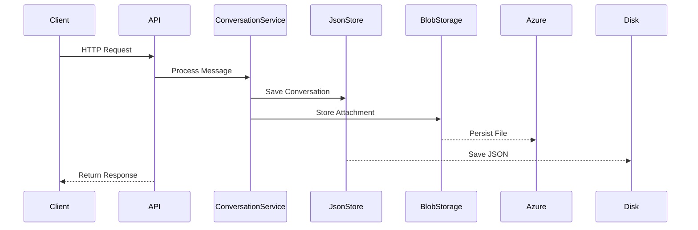

# Trapper Keeper API 🗂️

[](https://github.com/yourusername/trapper-keeper/actions)
[](LICENSE)

Modern API for conversation management and file storage with Azure integration.

## ✨ Features
- **Conversation Management**: Full CRUD operations with JSON persistence
- **File Handling**: Azure Blob Storage integration for attachments
- **AI Readiness**: Structured for OpenAI integration
- **Configuration**: YAML-based with environment overrides

## 🚀 Getting Started

### Prerequisites
- .NET 9.0 SDK
- Azure Storage Account

### ⚙️ Configuration

1. Create `appsettings.yaml`:
```yaml
Azure:
  Storage:
    ConnectionString: "DefaultEndpointsProtocol=..."
    ContainerName: "attachments"

OpenAI:
  ApiKey: "your-api-key-here"

Application:
  MaxFileSizeMB: 100
  StoragePath: "./conversations"
```

2. Environment variables override YAML settings:
```bash
export Azure__Storage__ConnectionString="ActualConnectionString"
export Application__StoragePath="/mnt/volume"
```

### 🏃 Running the API
```bash
make build
make run
```
Access Swagger UI at: http://localhost:5000/swagger

## 📚 API Endpoints

### 💬 Conversations
| Method | Path | Description |
|--------|------|-------------|
| POST   | /chat | Create new conversation |
| GET    | /chat/{id} | Retrieve conversation |
| POST   | /chat/{id}/messages | Add message |

### 📎 Files
| Method | Path | Description |
|--------|------|-------------|
| POST   | /files | Upload file |
| GET    | /files/{id} | Download file |

## 🛠️ Development

### Key Components
```
src/
├── TrapperKeeper/
│   ├── Controllers/        # API endpoints (Chat/File)
│   ├── Services/           # Core business logic
│   ├── Models/             # Data contracts
│   ├── appsettings.yaml    # YAML configuration
│   ├── Program.cs          # Startup/DI configuration
│   └── Properties/         # Assembly metadata
```

### Build Commands
```bash
make test    # Run all unit tests
make docker  # Build Docker image
make deploy  # Deploy to Kubernetes
```

### Architecture


## 📜 License
MIT License - See [LICENSE](LICENSE) for details.
