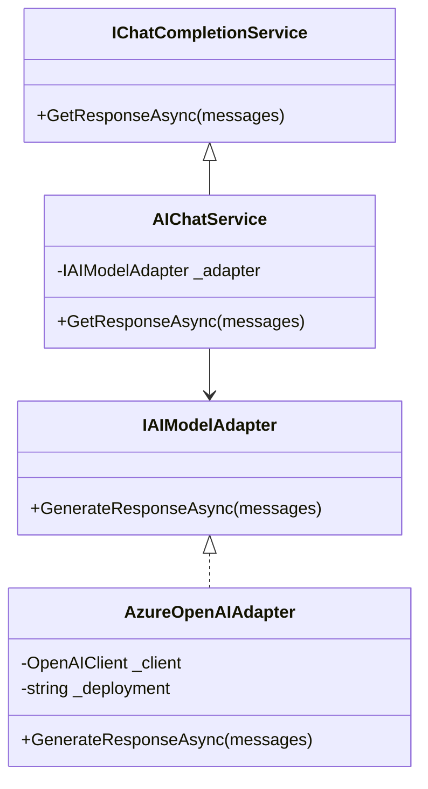

# Adapter Pattern Implementation Guide

## Architecture Overview


## Implementation Steps

1. **Interface Definition**
```csharp
public interface IAIModelAdapter
{
    Task<string> GenerateResponseAsync(IEnumerable<ChatMessage> messages);
}
```

2. **Azure Implementation**
```csharp
public class AzureOpenAIAdapter : IAIModelAdapter
{
    // Implementation details
}
```

3. **Service Integration**
```csharp
public class AIChatService : IChatCompletionService
{
    private readonly IAIModelAdapter _adapter;

    public AIChatService(IAIModelAdapter adapter)
    {
        _adapter = adapter;
    }

    public async Task<string> GetResponseAsync(IEnumerable<ChatMessage> messages)
    {
        return await _adapter.GenerateResponseAsync(messages);
    }
}
```

## Benefits
- Decouples Azure SDK from core logic
- Enables multi-provider support
- Simplifies testing through mocking
- Centralizes AI configuration

## Migration Plan
1. Create adapter interfaces
2. Implement Azure adapter
3. Update service layer
4. Update DI configuration
5. Phase out direct SDK usage